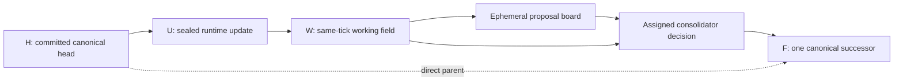

# Axon continuously ticking runtime

> **Preserved ExactV4 foundation — not the active Axon runtime.** As of
> 2026-08-20, production materialization fails closed because this implementation
> can let a core propose after one 384x16 physical view rather than after a
> complete logical-field sweep. The checked-in CPU descriptor remains frozen
> regression evidence. See `docs/CANONICAL_STATE_RECONCILIATION.md` for the D64
> canonical-runtime boundary.

This document describes the preserved runtime implemented in
`runtime/axon_runtime` and the four-core CPU regression configuration in
`ops/axon_runtime.cpu-smoke.json`.

The foundation is a durable transaction engine around the existing exact-v4
64D and 128D checkpoints. It is not evidence that those checkpoints can hold a
useful conversation, and it is no longer an authorized production anatomy.
Its journal, role rotation, private-state, validation, and crash-recovery work
remain useful implementation evidence while the D64 complete-field compiler
path is wired.

## Current boundary

Implemented now:

- one append-only, hash-chained runtime journal;
- a ten-region canonical shared field;
- one canonical successor per tick;
- a rotating proposer, consolidator, sleeper, and standby;
- four logical cores over two strictly pinned exact-v4 checkpoints;
- private soul, cursor, cursor-anchor, adapter-manifest, and RNG state per
  logical core;
- a bounded active projection over unbounded canonical history;
- an exact dormant source archive and conservative candidate knowledge;
- durable ingress and atomic consumption receipts;
- strict typed invocation parsing with execution disabled;
- restart reconciliation from journal-referenced private state; and
- an explicit forever loop with a stop event, stop file, bounded error
  backoff, and bounded-run mode for smoke tests.

Not implemented or not proven:

- conversational competence;
- autonomous web research;
- live shell, filesystem, advisor, or tools-folder effects in the configured
  runtime;
- neural semantic extraction by the sleeping core;
- warm-to-cold soul consolidation in this runtime;
- LoRA creation, loading, or causal proof;
- a private diary per logical core;
- simultaneous multi-region neural writes in one tick; or
- a tokenizer path.

## Runtime topology

The CPU smoke descriptor pins two physical inference models and gives each
model two logical identities:

| Logical core | Shared model | Checkpoint step | Private soul | Adapter namespace |
|---|---|---:|---|---|
| `axon64-a` | 64D, 2 layers, 1 head, FFN 131072 | 416000 | `soul64-a` | `adapter.axon64.a` |
| `axon128-a` | 128D, 2 layers, 1 head, FFN 262144 | 252000 | `soul128-a` | `adapter.axon128.a` |
| `axon64-b` | 64D, 2 layers, 1 head, FFN 131072 | 416000 | `soul64-b` | `adapter.axon64.b` |
| `axon128-b` | 128D, 2 layers, 1 head, FFN 262144 | 252000 | `soul128-b` | `adapter.axon128.b` |

The exact paths and full SHA-256 pins are authoritative in
`ops/axon_runtime.cpu-smoke.json`. Bootstrap verifies the checkpoint path,
file hash, step, `d_model`, and strict-loaded inference state before it creates
or restores a logical core.

Each model ID is loaded once. Its frozen inference weights are shared by its
two logical clones behind an inference lock; a clone does not duplicate the
large immutable transformer. Each logical core does have its own:

- content-addressed soul tensor and mask;
- soul and core generation numbers;
- field-view cursor;
- cursor anchors used to preserve valid append-only progress and reset changed
  regions;
- adapter namespace and adapter manifest;
- RNG manifest; and
- last committed field and candidate evidence.

The initial adapter manifests are empty. A distinct namespace is a durable
place for future adapters, not a claim that LoRA adapters already exist.

## The ten shared-field regions

The canonical field has a fixed logical order:

| Region | Current writer | Current behavior |
|---|---|---|
| `conversation_history` | runtime ingress | append exact conversation spans |
| `user_input` | runtime ingress | expose current input, then clear on a later tick with no new input |
| `structured_knowledge` | runtime ingress | append provenance-bearing knowledge spans; a separate retrieval helper can derive surfaced spans |
| `situation_awareness` | runtime ingress | replace the live value; retain earlier evidence in the journal |
| `tool_results` | runtime ingress | append inert result spans |
| `advisor_input` | runtime ingress | append inert advisor-result spans |
| `task_state` | runtime ingress | replace the live value; retain earlier evidence in the journal |
| `scratch` | core-writable | available as a core target, but not the bootstrap default |
| `response_draft` | core-writable | default neural target; consolidator has final authority |
| `diary` | runtime ingress | append shared diary spans |

Eight regions are sealed from direct core deltas. `scratch` and
`response_draft` are the only core-writable regions. The materialized runtime
currently targets `response_draft`; changing the target to `scratch` is
supported by the engine contract, but writing both in one inference pass is
not yet implemented.

The diary region is shared and ingress-owned today. Per-core personality
continuity currently lives in each private soul, not in a separately exposed
private diary.

## One tick: H -> U -> W -> F

Every successful loop iteration produces exactly one canonical successor.



1. **H — head.** The engine recovers the journal-backed canonical head and
   reconciles every logical core to the private-state manifest referenced by
   that head.
2. **U — system update.** Pending ingress is compiled into a sealed,
   whole-span update anchored to H. User input, tool results, advisor results,
   diary entries, knowledge, situation awareness, and task state enter here.
3. **W — working field.** Applying U creates an immutable same-tick working
   snapshot. W is what the cores observe, but W is not a second canonical
   tick.
4. **Proposal board.** The assigned proposer reads an authenticated full or
   projected view of W. Its candidate is placed on an ephemeral board so the
   consolidator can inspect it. The board is never canonical truth.
5. **Consolidation.** The assigned consolidator reads the board and authors a
   fresh candidate. Only the consolidator-authored delta can be applied to W.
6. **F — final successor.** The accepted consolidator delta, if any, is
   composed with U into one tick-plus-one snapshot whose direct parent is H.
   The proposal, decision, field transaction audit, core-state manifests,
   projection, tool outbox, and ingress receipts are committed together.

If the consolidation gate rejects the candidate, the tick still advances.
F contains the sealed system update but no core delta, no private-core update,
and no tool request. This auditable no-op successor preserves role rotation
and continuous time without pretending a rejected response was accepted.

### Consolidator authority

The proposer is advisory. Matching proposer and consolidator text may allow
both corresponding private candidate states to advance, but that does not
give the proposer field authority. The final `response_draft` is always the
assigned consolidator's accepted text.

## Role rotation

The configured ring is:

1. `axon64-a`
2. `axon128-a`
3. `axon64-b`
4. `axon128-b`

For tick sequence `t`, the proposer is ring position `t mod 4`, the
consolidator is the previous position, and the sleeper is two positions
behind. Every remaining core is standby. With four cores, that leaves one
standby each tick.

All four configured cores currently have proposer, consolidator, and sleeper
capability. This avoids a permanently privileged consolidator. It does not
prove that the 64D and 128D checkpoints are equally competent; changing role
eligibility should be driven by behavioral gates rather than model size
alone.

The sleeper currently owns one bounded post-commit dormant-work quantum. The
deterministic worker, not the sleeping neural core, performs the extraction.
The sleeper's soul is not trained or compressed merely because it held the
sleeper role.

## Exact field, active projection, and dormant knowledge

Axon distinguishes permanent source truth from the bounded view used for one
inference action.

### Canonical source truth

- Runtime events and tick records live in an append-only SQLite journal with
  an event hash chain.
- Journal rows cannot be updated or deleted through the store schema.
- Earlier snapshots and replaced live values remain replayable from journal
  truth.
- Dormant source records store exact UTF-8 text byte-for-byte with provenance.
- Dormant containers, entities, triples, lifecycle events, jobs, and
  surfacing decisions are immutable revisions, not in-place rewrites.

The small mutable runtime-head tables are caches/projections of journal truth;
they are not the authority.

### Active projection

The CPU smoke policy selects whole spans under a 4096-character global budget
and per-region budgets. It never slices an old span to make it fit. Omitted
spans receive explicit mask records containing their hashes, provenance, and
references. The source snapshot remains unchanged.

`user_input`, `response_draft`, `scratch`, and the currently active
`tool_results` working set are pinned by policy. Pinned status does not
override an existing masked or dormant lifecycle state, so an older tool
result can leave the active view after that transition. The current hook does
not yet age pinned tool results automatically; without a separate lifecycle
policy, an oversized pinned region fails closed rather than slicing text.

The exact-v4 neural core still consumes an exact `384 x 16` compiled read
page. That is a cursor-driven pager over the selected field, not the
architecture's memory limit and not the maximum shared-field size. The
canonical field can continue to grow while each core advances its own durable
page cursor.

### Bounded idle extraction

After a committed tick, the sleeper-owned hook can:

1. capture a bounded number of masked whole spans into the exact source
   archive;
2. queue deterministic extraction jobs;
3. lease and process a bounded number of jobs;
4. create provenance-linked entity, container, and triple revisions; and
5. transition captured spans from masked to dormant.

The smoke configuration permits at most 32 captures and 8 jobs in one quantum,
with one quantum per tick. Work is restartable and idempotent.

The bootstrap extractor recognizes only explicit readable clauses using
`is`, `has`, `uses`, `needs`, and `wants`. Its triples are labelled
**candidates, not semantic proof**. Acceptance, contradiction handling,
richer entity resolution, and neural idle reasoning remain future work.

## Ingress

Ingress is durable and append-only. Each source has a monotonic sequence and
each event has an idempotency key. Supported event kinds are:

- `user_input`
- `conversation_history`
- `tool_result`
- `advisor_result`
- `diary`
- `situation_awareness`
- `task_state`
- `structured_knowledge`

Consumption receipts are written in the same SQLite transaction as the tick
that used the events. A failed tick leaves its input pending; a committed tick
cannot silently consume the same event again.

Tool and advisor results are data on the next tick. They are inert and are
never reparsed as fresh commands.

## Typed invocation protocol

The marker characters are lexical sugar inside one exact envelope:

```text
:::axon-invoke/v1
$$ {"action_id":"check-status","mode":"direct","program":"git","argv":["status"],"root":"workspace","cwd":"."}
## {"action_id":"read-readme","op":"read_text","root":"workspace","path":"README.md"}
@@ {"action_id":"ask-reviewer","advisor":"reviewer","prompt":"Review the current field."}
&& {"action_id":"run-health-check","tool":"health-check","args":[]}
:::end
```

Each body line must be one marker, one space, and one strict one-line JSON
object. The names in this example would still need matching durable registry
entries and policy before they could execute:

- `$$` — an explicitly registered shell/program request;
- `##` — a rooted filesystem request;
- `@@` — a registered advisor/provider/model request;
- `&&` — a pinned script under a registered tools root.

Markers outside the exact envelope are ordinary text. Envelopes inside
CommonMark backtick or tilde code fences are inert. Malformed or ambiguous
envelopes fail closed.

In the tick engine, only an accepted consolidator output is inspected for this
outbox. Parsing creates durable `ToolRequestRecord` values; it does not perform
the effects.

Both `typed_tools_enabled` and `advisors_enabled` are `false` in the CPU smoke
configuration, and the current bootstrap schema rejects `true`. The
lower-level policy and executor code exists for controlled testing, but no
runtime dispatcher grants it authority. Autonomous shell work, filesystem
mutation, advisor calls, and web scraping are therefore not enabled.

## Commit, crash, and restart contract

The runtime is designed so model state cannot quietly get ahead of or behind
canonical field truth:

1. A core action is staged without mutating live private state.
2. If accepted, candidate soul and private-runtime bytes are written to
   content-addressed stores before the SQLite tick commit.
3. One `BEGIN IMMEDIATE` transaction commits the field successor and every
   journal reference.
4. Only after that database commit does the driver install the candidate in
   RAM.
5. If post-commit installation fails, the driver reloads the exact
   journal-referenced private state.
6. If neither installation nor reload succeeds, the forever loop fails closed
   instead of running another tick with stale RAM.

SQLite uses WAL mode, foreign keys, and `synchronous=FULL`. Startup strictly
replays and verifies the journal, compares mutable projections with replayed
truth, verifies the configured identity ring, reads every referenced private
artifact, and reconciles all live logical cores before ticking. A runner lock
prevents two processes from owning the same state root.

A sleeper-hook failure after a canonical commit is reported as a post-commit
warning and does not relabel an already committed tick as failed. The bounded
dormant job remains retryable. Projection failures occur before commit and
therefore do not advance canonical truth.

`recover()` deliberately reports mutable-cache drift rather than silently
repairing it. `RuntimeStore.rebuild_runtime_head_from_journal()` is the
explicit repair operation after an operator has investigated the cause.

## Operator interface and CPU smoke

The module CLI is available through:

```powershell
python -m runtime.axon_runtime --help
```

It uses `ops/axon_runtime.cpu-smoke.json` by default. To select another strict
descriptor, place `--config PATH` before the subcommand.

Useful commands are:

```powershell
# Read status without creating state or loading checkpoints.
python -m runtime.axon_runtime status

# Strict-load both checkpoints and initialize durable state without ticking.
python -m runtime.axon_runtime run --max-ticks 0

# Append one exact input after the runtime database has been initialized.
python -m runtime.axon_runtime enqueue --kind user_input --text "Hello, Axon."

# Complete one bounded proposer rotation.
python -m runtime.axon_runtime run --max-ticks 4

# Historical operator examples only; `run` now fails closed on this legacy anatomy.
python -m runtime.axon_runtime run
python -m runtime.axon_runtime stop
python -m runtime.axon_runtime run --clear-stop --max-ticks 4

# Use focused tests/explicit legacy tooling for regression evidence until the
# canonical D64 runtime driver replaces ExactV4 materialization.
```

`status` reports the current head, next role assignment, pending ingress, and
tool-outbox counts without loading either checkpoint. `enqueue` requires an
already initialized runtime database and accepts all ingress kinds listed
above, plus optional source, sequence, idempotency-key, and provenance
arguments. `stop` writes the configured durable stop marker idempotently.

The Python assembly API remains `load_runtime_config()` followed by
`materialize_runtime()`. Importing the package alone does not load a checkpoint
or start a loop.

The default operator descriptor is:

```text
D:\Axon\ops\axon_runtime.cpu-smoke.json
```

The preserved CPU regression descriptor now writes only inside an isolated,
non-authoritative training branch:

```text
D:\Axon\State\training\regression\exact_v4_runtime_smoke
```

It must not recreate a top-level `State\axon_runtime` tree.

A bounded four-tick run is the first meaningful structural CPU smoke because
it completes one proposer rotation across the four-core ring. It should verify
checkpoint pins, logical identity restoration, role movement, H/U/W/F commits,
private-state persistence, and clean restart. It should not be graded as an
English conversation test.

### Verified real-checkpoint smoke

On 2026-07-27, the configured real 64D and 128D checkpoints completed four CPU
ticks followed by a cold restart:

- final generation: `4`;
- final tick sequence: `4`;
- final field ID:
  `85a1b1d7d93dd588213f9d505e6f9a04e652393851d9d98610488c51ca6516f6`;
- journal replay exactly matched the recovered head;
- the four-core role ring returned to role index `0`;
- pending ingress: `0`;
- queued tool requests: `0`;
- executed effects: `0`; and
- the response draft remained empty.

This passes the bounded transaction, persistence, rotation, and cold-restart
smoke. The empty response draft is important negative evidence: it does not
establish conversational behavior or useful recursive reasoning from the
current checkpoints.

The two physical checkpoints are large. Sharing immutable weights prevents
logical clones from multiplying that cost, but loading both real models still
requires material CPU RAM and startup time. Use `--max-ticks` for the first
run; do not start the unbounded loop as an import side effect or as an
unobserved test.

An unbounded `run` ticks until an explicit stop event or configured stop file
is observed. Ordinary tick failures use bounded exponential backoff. A
committed-state recovery failure stops immediately because continuing with
stale private state would violate the journal contract.

## Tokenizer decision

Tokenization is explicitly deferred.

The frozen 16D exact-character substrate remains input/output authority. The
runtime is being proven first with the checkpoints that already exist. A
future tokenizer experiment should be one shared, reversible, Axon-owned
derived sidecar with exact character offsets and round-trip gates—not a
different tokenizer per core and not a replacement for canonical exact text.

That future branch can use cloned checkpoints and a trained adapter. It does
not require throwing away the 64D and 128D checkpoints, but it does require
separate compatibility, causal-ablation, quality, and measured CPU-throughput
evidence before becoming the default path.

## Honest limitations and next proof gates

- The 64D step-416000 and 128D step-252000 exact-v4 checkpoints are
  experimental. Existing evaluations do not establish useful free-form
  reasoning or conversation.
- The current bootstrap asks one 384-character page per neural action. Multiple
  ticks and durable cursors provide coverage; they do not make one action
  globally attentive.
- Only the accepted consolidator candidate updates canonical response text.
  The engine does not yet run a multi-pass scratch/response planner within one
  tick.
- Only accepted acting-core candidates advance their private souls. Standby
  and sleeper identities do not absorb the entire field automatically.
- The 64D checkpoint can expose its trained hot-to-warm compressor, while the
  128D checkpoint is hot-only, but the runtime does not yet schedule or prove
  offline compression.
- Adapter namespaces are present, but no LoRA distillation or load-bearing
  adapter evidence exists.
- Dormant extraction is deliberately conservative and syntactic. A rich,
  trustworthy knowledge graph still requires acceptance policy, contradiction
  handling, retrieval gates, and causal tests.
- Advisor configuration code supports registered providers and secret
  environment-variable references, but the assembled runtime does not enable
  advisor calls.
- No autonomous browsing or website scraping is wired into idle time.
- Tool execution remains outbox-only and disabled. Enabling effects later must
  include durable policy, a dispatcher, result journaling, Windows process-tree
  timeout handling, and explicit failure semantics.
- The lower-level executor supports byte-bounded stdout and stderr capture.
  Before effects are enabled, the no-delete doctrine needs an exact raw-output
  archive or another explicit source-preservation rule; a clipped field view
  must never be mistaken for the complete external result.

The next milestone is therefore not “declare Axon alive.” It is a bounded real
checkpoint smoke that proves role rotation, canonical continuity, private soul
separation, restart, dormant capture, and exact ingress round-trip without
corrupting the protected checkpoint files.

## Code map

- `runtime/axon_runtime/engine.py` — tick orchestration and forever loop
- `runtime/axon_runtime/field_transaction.py` — H/U/W/F composition
- `runtime/axon_runtime/store.py` — journal, atomic commit, and replay
- `runtime/axon_runtime/roles.py` — deterministic role rotation
- `runtime/axon_runtime/checkpoint.py` — strict exact-v4 checkpoint inspection
- `runtime/axon_runtime/core_backend.py` — shared models and private clones
- `runtime/axon_runtime/exact_driver.py` — two-phase private-state adapter
- `runtime/axon_runtime/ingress.py` — durable input and consumption receipts
- `runtime/axon_runtime/projection.py` — whole-span active masking
- `runtime/axon_runtime/dormant.py` — exact source and knowledge revisions
- `runtime/axon_runtime/idle.py` — bounded sleeper-owned dormant work
- `runtime/axon_runtime/tool_protocol.py` — strict marker envelopes and policy
- `runtime/axon_runtime/advisors.py` — registered provider definitions
- `runtime/axon_runtime/config.py` — strict bootstrap descriptor
- `runtime/axon_runtime/bootstrap.py` — explicit resource materialization
